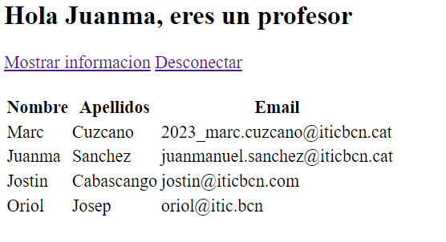
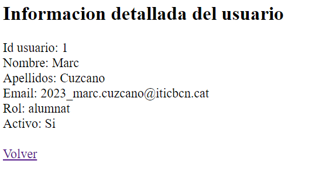

# ACTIVIDAD 5 - PHP/MYSQL - LOGIN

## Requisitos

- Servidor web con PHP y MySQL.
- Acceso a phpMyAdmin para la gestión de la base de datos.

## Objetivos de la actividad

* Aprender a utilizar SESIONES.
* Organizar el proyecto entre lógica de negocios, funcionalidad y vistas.
* Control de las rutas de los proyectos.
* Resolución de problemas.
* Aprender Markdown.
* Aprender Git y GitHub.
* Aprender a refactorizar el código.

## El usuario tiene rol de profesor :

## El usuario tiene rol de alumno:

## Mostrar informacion detallada de un usuario :

